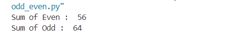
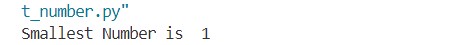
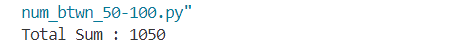
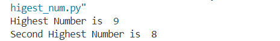
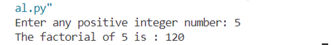
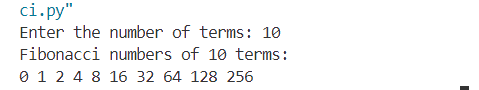
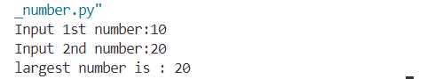
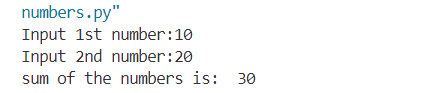

<h2 id="odd-even">01. Write a Python program to find the sum of odd and even numbers from a
set of numbers.</h2>

This program takes a predefined list of numbers and calculates the sum of odd and even numbers separately.
It iterates through the list, checks each number's parity and adds it to the corresponding sum.

 <pre></pre>

<h2 id="smallest-number">02. Write a Python program to find the smallest number from a set of
numbers.</h2>

This program finds the smallest number in a given list. It initializes a variable with the first number in the list
and iterates through the remaining numbers, updating the smallest value whenever a smaller number is found.

 <pre></pre>

<h2 id="sum-divisible">03. Write a Python program to find the sum of all numbers between 50 and
100, which are divisible by 3 and not divisible by 5.</h2>

This program calculates the sum of numbers in the range of 50 to 100 that are divisible by 3 but not by 5.
It iterates through the range, checks each number's divisibility conditions, and sums up the valid numbers.

 
 <pre></pre>

<h2 id="second-highest">04. Write a Python program to find the second-highest number from a set of
numbers.</h2>

This program determines both the highest and second-highest numbers in a given list.
It first sorts the list in descending order and then picks the first and second elements as the highest and second-highest values.

 <pre></pre>

<h2 id="factorial">05. Write a Python program to find the factorial of a number using for loop.</h2>

This program calculates the factorial of a user-inputted number using a loop.
The factorial of a number (n!) is the product of all positive integers up to that number.
For example, 4! = 4 × 3 × 2 × 1 = 24.

 <pre></pre>

<h2 id="fibonacci">06. Write a Python program to generate Fibonacci series.</h2>

This program generates the Fibonacci sequence up to a specified number of terms.
The Fibonacci sequence starts with 0 and 1, and each subsequent number is the sum of the two preceding ones.
For example, the first 6 terms are: 0, 1, 1, 2, 3, 5.

 <pre></pre>

<h2 id="largest-number">07. Write a Python program to find the largest number between two
numbers using function</h2>

This program takes two numbers as input and determines which one is larger.
It uses a simple conditional statement to compare both values and prints the larger number.

 <pre></pre>

<h2 id="sum-parameters">08. Write a Python program to find the sum of the numbers passed as
parameters.</h2>

This program takes two user-inputted numbers, adds them together, and prints the sum.
It demonstrates the use of function parameters and basic arithmetic operations.

 <pre></pre>
